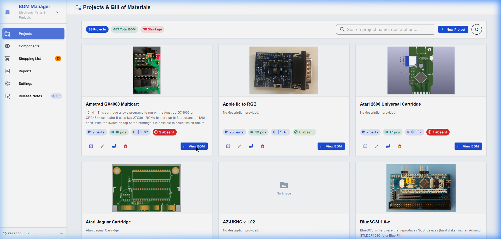
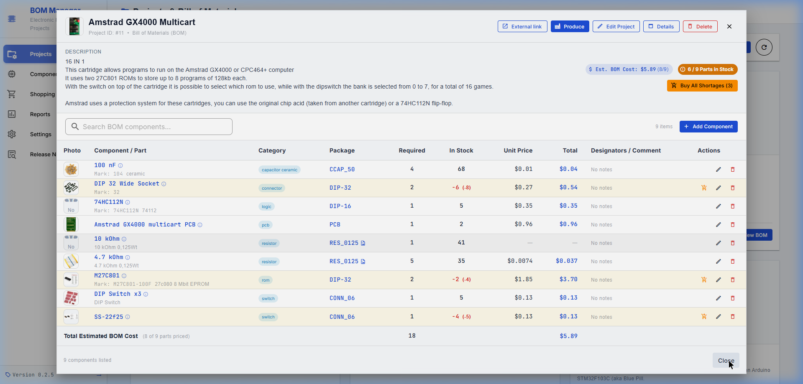
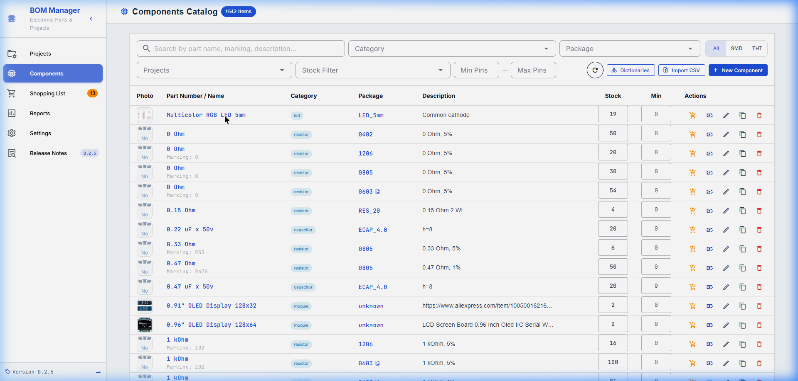
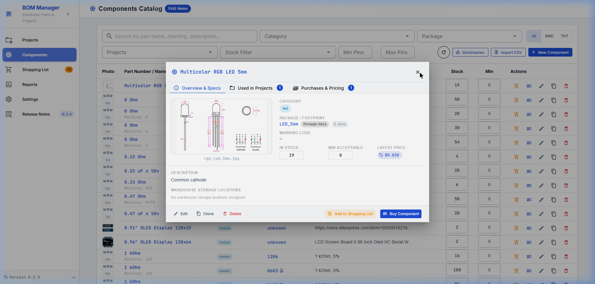
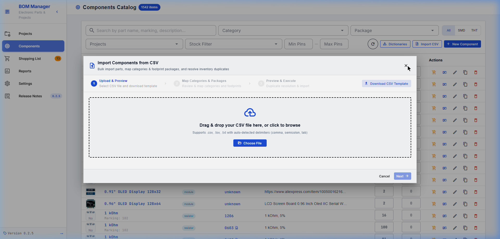
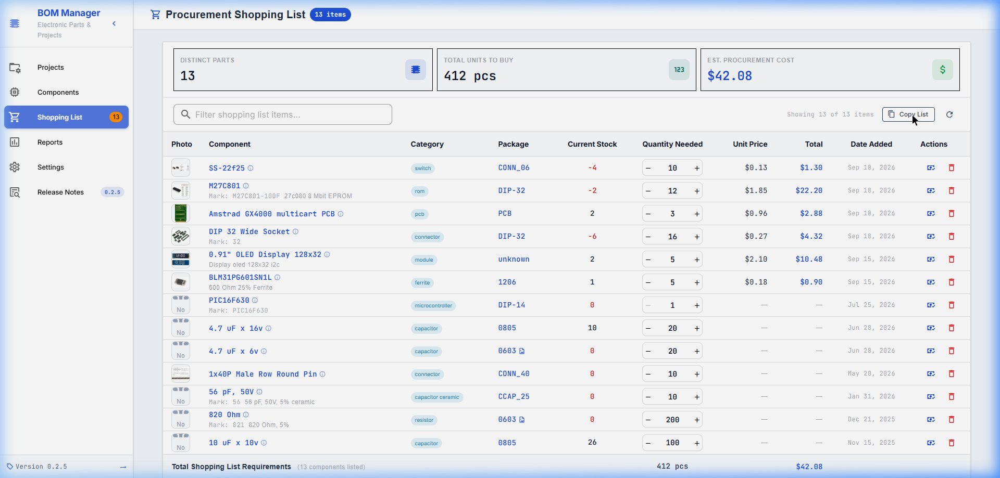
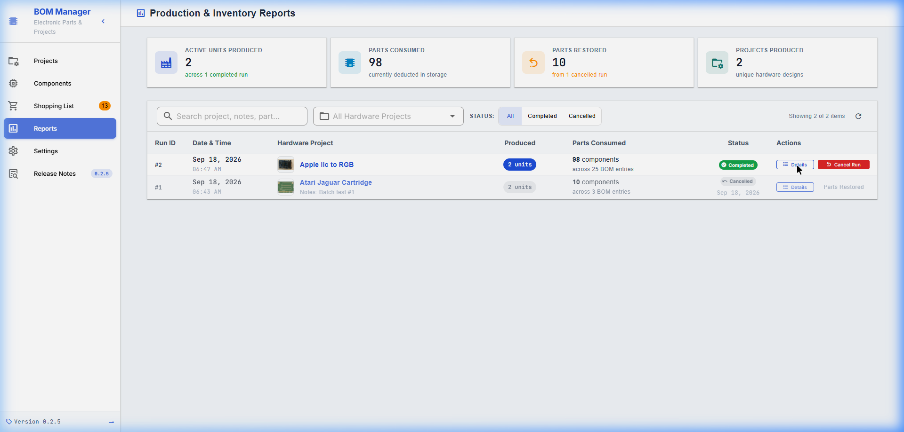
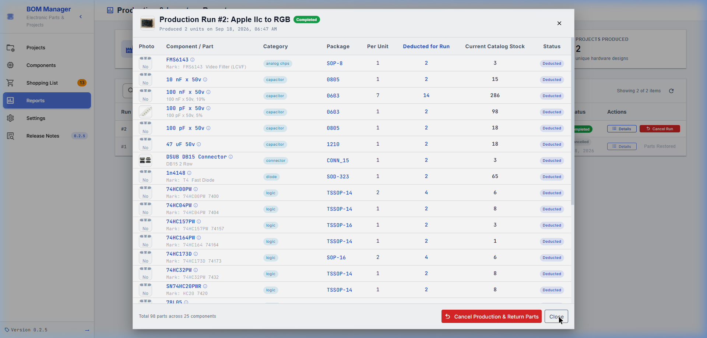
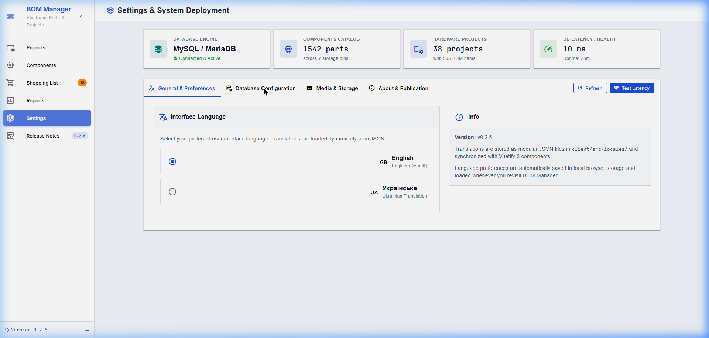

# Посібник користувача платформи BOM Manager

[🇬🇧 English version](GUIDE_EN.MD)

**BOM Manager** — це веб-система для інженерів-електроніків, R&D лабораторій та приладобудівних виробництв. Платформа дозволяє вести облік електронних компонентів, керувати специфікаціями виробів (Bill of Materials), контролювати складські залишки, планувати закупівлі та відстежувати виробничі партії.

---

## Зміст

1. [Головні можливості системи](#1-головні-можливості-системи)
2. [Керування проектами та специфікаціями BOM](#2-керування-проектами-та-специфікаціями-bom)
3. [Виробництво партій та списання зі складу](#3-виробництво-партій-та-списання-зі-складу)
4. [Каталог електронних компонентів](#4-каталог-електронних-компонентів)
5. [Масовий імпорт компонентів з CSV](#5-масовий-імпорт-компонентів-з-csv)
6. [Список закупівель (Shopping List)](#6-список-закупівель-shopping-list)
7. [Звіти з виробництва та складські логи](#7-звіти-з-виробництва-та-складські-логи)
8. [Системні налаштування та бази даних](#8-системні-налаштування-та-бази-даних)

---

## 1. Головні можливості системи

- **Єдиний каталог компонентів**: Централізована база мікросхем, пасивних елементів, роз'ємів і модулів із маркуванням, типами корпусів, даташитами та фотографіями.
- **Специфікації виробів (BOM)**: Зв'язок проектів із переліком необхідних компонентів, кількостями на 1 пристрій та схемотехнічними позначеннями (`C1, R4, U2`).
- **Складський облік та відстеження дефіциту**: Миттєвий розрахунок доступності деталей для складання запланованої кількості пристроїв.
- **Підтримка KiCAD iBOM**: Імпорт інтерактивних специфікацій KiCAD з автоматичною прив'язкою до існуючих деталей.
- **Масовий імпорт з CSV**: Інтелектуальний імпорт із зіставленням категорій та корпусів.
- **Багатомовність (i18n)**: Повноцінний інтерфейс українською та англійською мовами.

---

## 2. Керування проектами та специфікаціями BOM

Розділ **«Проекти»** відображає картки апаратних розробок. Кожна картка містить фотографію плати, назву, опис, посилання на репозиторій/документацію та лічильник позицій BOM.

### 2.1. Робота зі специфікацією (BOM)
При натисканні на кнопку **«Переглянути BOM»** відкривається модальне вікно специфікації:
- **Перелік компонентів**: Позиційні позначення (Designators), необхідна кількість на один виріб, поточний залишок на складі.
- **Індикація дефіциту**: Рядки з відсутніми або недостатніми деталями автоматично підсвічуються м'яким червоним кольором.
- **Додавання деталей**: Кнопка **«Додати деталь»** відкриває швидкий пошук по каталогу з фільтрацією за категоріями та корпусами.
- **Вкладення та файли**: До кожного проекту можна прикріплювати схеми, gerber-файли, інструкції та файли інтерактивного BOM.

### 2.2. Інтеграція з KiCAD Interactive HTML BOM (iBOM)
Платформа підтримує прямий імпорт файлів `ibom.html`, згенерованих плагіном KiCAD:
1. Завантажте файл `ibom.html` у вкладення проекту.
2. Натисніть кнопку **«Імпортувати iBOM»**.
3. Система автоматично розпізнає всі компоненти, їхні номінали, корпуси та позиційні позначення і запропонує прив'язати їх до існуючого каталогу або створити нові.

---

## 3. Виробництво партій та списання зі складу

Функція **«Виробити проект»** дозволяє зареєструвати випуск серії плат із автоматичним перерахунком залишків.

1. У специфікації проекту натисніть кнопку **«Виробити проект»**.
2. Введіть бажану кількість одиниць виробу (система автоматично розраховує максимально можливу кількість за поточними залишками деталей).
3. Система відображає зведену таблицю:
   - Кількість деталей на партію.
   - Залишок після випуску.
   - Виявлені дефіцити.
4. Якщо виявлено нестачу, однією кнопкою можна відправити всі відсутні деталі у **Список покупок**.
5. Після підтвердження кількості компонентів автоматично списуються з відповідних складських комірок.

---

## 4. Каталог електронних компонентів

Розділ **«Каталог компонентів»** надає потужні інструменти пошуку, групування та редагування запасів.

### 4.1. Фільтрація та пошук
- **Гнучкий пошук**: По назві деталі, маркуванню на мікросхемі, короткому чи повному опису.
- **Мультивибір категорій та корпусів**: Можливість обрати одночасно кілька типів корпусів (наприклад, `SOIC-8` та `DIP-8`).
- **Фільтр типу монтажу**: Швидкий перемикач `All` / `SMD` / `THT`.
- **Фільтр діапазону виводів (Pins)**: Відбір мікросхем за кількістю виводів (від/до).
- **Фільтр залишків**:
  - Відсутні (`0`).
  - Відсутні або нижче мінімального запасу.
  - Критичний залишок (Near to End).
  - У наявності (`> 0`).

### 4.2. Швидке редагування в таблиці
Поточний залишок (`qty`) та мінімально допустимий запас (`minQty`) можна змінювати безпосередньо в таблиці каталогу без відкриття додаткових вікон: просто клікніть на числове значення, змініть його та натисніть `Enter`.

### 4.3. Картка деталей компонента
Клік на назву або фотографію відкриває вікно з трьома розділами:
- **Огляд та характеристики**: Повне найменування, маркування, прикріплені даташити, фотографії та прив'язка до складських місць (бокси, полиці, шухляди).
- **Використання в проектах**: Список усіх проектів, у специфікаціях яких присутня ця деталь, із зазначенням позиційних позначень.
- **Закупівлі та ціни**: Повна фінансова аналітика — історія попередніх закупівель, середня та остання ціна, посилання на постачальників (LCSC, Mouser, AliExpress).

---

## 5. Масовий імпорт компонентів з CSV

Платформа містить покроковий майстер імпорту компонентів із електронних таблиць Excel та CSV файлів.

### 5.1. Порядок імпорту:
1. **Завантаження шаблону**:
   - Натисніть кнопку **«Завантажити шаблон CSV»** у правому верхньому куті майстра.
   - Шаблон постачається у форматі UTF-8 з BOM (`\uFEFF`), що запобігає пошкодженню кодування та кириличних літер в Microsoft Excel.
2. **Завантаження вашого файлу**:
   - Перетягніть файл у поле Dropzone або натисніть **«Обрати файл»**.
   - Підтримуються формати `.csv`, `.tsv`, `.txt`. Розділювач (кома `,`, крапка з комою `;`, табуляція `\t`) визначається автоматично.
3. **Зіставлення категорій та корпусів (Крок 2)**:
   - **Категорії**: Система співставляє назви з наявними в базі. За потреби можна зіставити з іншою категорією, створити нову або пропустити призначення.
   - **Корпуси**: Для нових корпусів можна одразу вказати тип монтажу (`SMD` чи `THT`) та кількість виводів (`Pins`).
4. **Стратегія обробки дублікатів (Крок 3)**:
   - **Пропускати наявні**: Якщо деталь із такою назвою вже є в базі, вона ігнорується.
   - **Оновити залишок**: Кількість із CSV додається до наявного складського запасу.
   - **Створювати дублікати**: Створюється окремий новий запис деталі.
5. **Запуск**: Усі операції виконуються в рамках єдиної транзакції бази даних, що гарантує цілісність даних.

---

## 6. Список закупівель (Shopping List)

Розділ **«Список покупок»** призначений для постачання та роботи з дефіцитними позиціями.

- **Агрегація потреб**: Деталі автоматично потрапляють сюди з проектів при нестачі або додаються вручну з каталогу.
- **Фінансовий розрахунок**: На основі останніх цін у системі автоматично підраховується орієнтовна вартість усієї закупівлі.
- **Експорт та копіювання**: Кнопка **«Копіювати список»** формує готовий структурований текст із найменуваннями та кількостями для відправки постачальникам або в чат закупівлі.
- **Оформлення закупівлі**: При купівлі вказується фактична ціна за одиницю, постачальник і посилання — деталь автоматично списується зі списку покупок, зараховується на склад, а замовлення додається до фінансової історії.

---

## 7. Звіти з виробництва та складські логи

Розділ **«Звіти»** фіксує історію виробничої діяльності та руху комплектуючих.

### 7.1. Зведена аналітика
- **Усього вироблено пристроїв**: Загальна кількість успішно зібраних виробів.
- **Витрачено деталей**: Сумарна кількість списаних комплектуючих за всіма завершеними партіями.
- **Унікальних проектів**: Кількість апаратних конструкцій, що випускалися на виробництві.

### 7.2. Деталізація партії та скасування випуску
Клік на кнопку **«Деталі»** виробничого запуску відкриває повний перелік списаних компонентів із їхніми початковими та кінцевими залишками.

Якщо партія була зареєстрована помилково або збирання скасовано, доступна функція **«Скасувати виробництво та повернути деталі»** — усі списані компоненти автоматично повертаються на склад у повному обсязі.

---

## 8. Системні налаштування та бази даних

Розділ **«Налаштування»** дозволяє налаштувати середовище функціонування платформи.

### 8.1. Мова інтерфейсу
Підтримується перемикання між **Українською** та **English**. Усі переклади підвантажуються динамічно без перезавантаження сторінки.

### 8.2. База даних
BOM Manager підтримує два режими роботи:
1. **SQLite 3 (Автономний режим)**: Ідеально підходить для локального використання, домашньої лабораторії або Docker-контейнера без необхідності піднімати додатковий сервер баз даних.
2. **MySQL 8 / MariaDB (Мережевий режим)**: Призначений для колективної роботи команди інженерів у локальній мережі або на віддаленому сервері.
3. **Діагностика**: Вкладка конфігурації показує поточну затримку (latency), кількість підключень та статус таблиць.

---

*Розроблено для надійного та прозорого обліку електроніки.*
